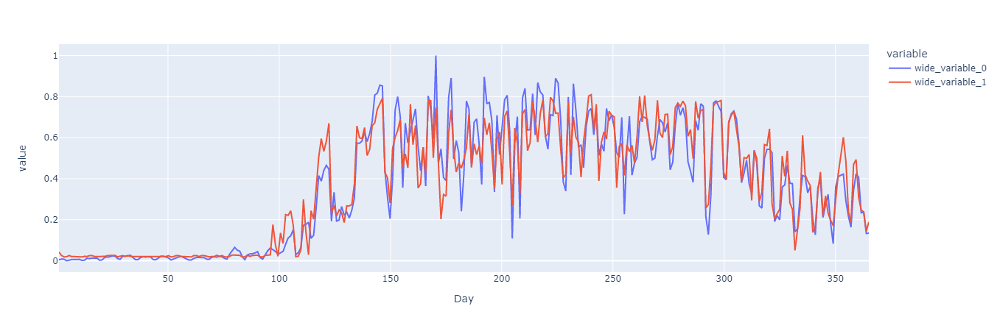

# Bikes vs Weather

## Model Comparison
|Engine  | MSE (train) | MSE (test) |
|--|--|--|
|Keras  | 0.0072  |0.0091 |
|TFLite Int8 |  0.007126 |0.00938|
|ITCL Quant Baseline| 0.007013|  0.009280|
|ITCL Quant Adaround & AdaParam | 0.0068581 | 0.0081774 |

## Plots

### Keras

