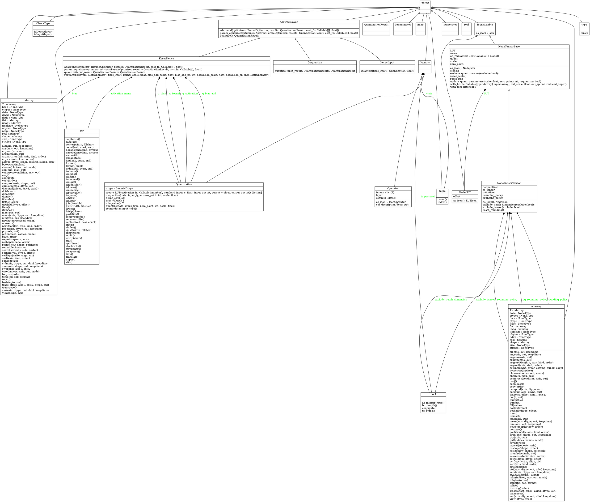

# Tensor Extractor

## Tensor.py
tensor.py stores a Base Node.

```graphviz

digraph "classes" {
charset="utf-8"
rankdir=BT
"0" [label="{AbstractLayer|\l|adaround(optimizer: IRoundOptimizer, results: QuantizationResult, cost_fn: Callable[[], float])\lparam_equalizer(optimizer: AbstractParamOptimizer, results: QuantizationResult, cost_fn: Callable[[], float])\lquantize(): QuantizationResult\l}", shape="record"];
"1" [label="{CheckType|\l|isDense(layer)\lisInput(layer)\l}", shape="record"];
"2" [label="{Dequantize|\l|quantize(input_result: QuantizationResult): QuantizationResult\l}", shape="record"];
"3" [label="{Generic|\l|}", shape="record"];
"4" [label="{ISerializable|\l|as_json(): json\l}", shape="record"];
"5" [label="{KerasDense|\l|adaround(optimizer: IRoundOptimizer, results: QuantizationResult, cost_fn: Callable[[], float])\lparam_equalizer(optimizer: AbstractParamOptimizer, results: QuantizationResult, cost_fn: Callable[[], float])\lquantize(input_result: QuantizationResult): QuantizationResult\lrequantize(layers: List[Operator], float_input, kernel_scale: float, bias_add_scale: float, bias_add_zp: int, activation_scale: float, activation_zp: int): List[Operator]\l}", shape="record"];
"6" [label="{KerasInput|\l|quantize(float_input): QuantizationResult\l}", shape="record"];
"7" [label="{NodeLUT|offset\l|as_json(): LUTJson\l}", shape="record"];
"8" [label="{NodeTensorBase|LUT\lname\lon_requantize : list[Callable[[], None]]\lquant\lscale\lzero_point\l|as_json(): NodeJson\lclone()\lexclude_quant_params(exclude: bool): \lreset_scale()\lreset_zp()\lupdate_quant_parameters(scale: float, zero_point: int, requantize: bool)\lwith_lut(fn: Callable[[np.ndarray], np.ndarray], out_scale: float, out_zp: int, reduced_depth): \lwith_tensor(tensor): \l}", shape="record"];
"9" [label="{NodeTensorTensor|dequantized\lfp_tensor\lquantized\lrounding_policy\lrounding_policy\l|as_json(): NodeJson\lexclude_batch_dimension(exclude: bool): \lexclude_tensor(exclude: bool): \lreset_rounding()\l}", shape="record"];
"10" [label="{Operator|inputs : list[T]\llayer\loutputs : list[E]\l|as_json(): JsonOperator\lset_description(desc: str): \l}", shape="record"];
"11" [label="{Quantization|dtype : GenericDtype\l|create_LUT(activation_fn: Callable[[number], number], input_s: float, input_zp: int, output_s: float, output_zp: int): List[int]\ldequantize(data: input_type, zero_point: int, scale: float): \ldtype_str(): str\lmax_value(): T\lmin_value(): T\lquantize(data: input_type, zero_point: int, scale: float): \lround(data: input_type): \l}", shape="record"];
"12" [label="{QuantizationResult|\l|}", shape="record"];
"13" [label="{bool|\l|as_integer_ratio()\lbit_length()\lconjugate()\lto_bytes()\l}", shape="record"];
"14" [label="{denominator|\l|}", shape="record"];
"15" [label="{imag|\l|}", shape="record"];
"16" [label="{ndarray|T : ndarray\lbase : NoneType\lctypes : NoneType\ldata : NoneType\ldtype : NoneType\lflags : NoneType\lflat : ndarray\limag : ndarray\litemsize : NoneType\lnbytes : NoneType\lndim : NoneType\lreal : ndarray\lshape : ndarray\lsize : NoneType\lstrides : NoneType\l|all(axis, out, keepdims)\lany(axis, out, keepdims)\largmax(axis, out)\largmin(axis, out)\largpartition(kth, axis, kind, order)\largsort(axis, kind, order)\lastype(dtype, order, casting, subok, copy)\lbyteswap(inplace)\lchoose(choices, out, mode)\lclip(min, max, out)\lcompress(condition, axis, out)\lconj()\lconjugate()\lcopy(order)\lcumprod(axis, dtype, out)\lcumsum(axis, dtype, out)\ldiagonal(offset, axis1, axis2)\ldot(b, out)\ldump(file)\ldumps()\lfill(value)\lflatten(order)\lgetfield(dtype, offset)\litem()\litemset()\lmax(axis, out)\lmean(axis, dtype, out, keepdims)\lmin(axis, out, keepdims)\lnewbyteorder(new_order)\lnonzero()\lpartition(kth, axis, kind, order)\lprod(axis, dtype, out, keepdims)\lptp(axis, out)\lput(indices, values, mode)\lravel(order)\lrepeat(repeats, axis)\lreshape(shape, order)\lresize(new_shape, refcheck)\lround(decimals, out)\lsearchsorted(v, side, sorter)\lsetfield(val, dtype, offset)\lsetflags(write, align, uic)\lsort(axis, kind, order)\lsqueeze(axis)\lstd(axis, dtype, out, ddof, keepdims)\lsum(axis, dtype, out, keepdims)\lswapaxes(axis1, axis2)\ltake(indices, axis, out, mode)\ltobytes(order)\ltofile(fid, sep, format)\ltolist()\ltostring(order)\ltrace(offset, axis1, axis2, dtype, out)\ltranspose()\lvar(axis, dtype, out, ddof, keepdims)\lview(dtype, type)\l}", shape="record"];
"17" [label="{ndarray|T : ndarray\lbase : NoneType\lctypes : NoneType\ldata : NoneType\ldtype : NoneType\lflags : NoneType\lflat : ndarray\limag : ndarray\litemsize : NoneType\lnbytes : NoneType\lndim : NoneType\lreal : ndarray\lshape : ndarray\lsize : NoneType\lstrides : NoneType\l|all(axis, out, keepdims)\lany(axis, out, keepdims)\largmax(axis, out)\largmin(axis, out)\largpartition(kth, axis, kind, order)\largsort(axis, kind, order)\lastype(dtype, order, casting, subok, copy)\lbyteswap(inplace)\lchoose(choices, out, mode)\lclip(min, max, out)\lcompress(condition, axis, out)\lconj()\lconjugate()\lcopy(order)\lcumprod(axis, dtype, out)\lcumsum(axis, dtype, out)\ldiagonal(offset, axis1, axis2)\ldot(b, out)\ldump(file)\ldumps()\lfill(value)\lflatten(order)\lgetfield(dtype, offset)\litem()\litemset()\lmax(axis, out)\lmean(axis, dtype, out, keepdims)\lmin(axis, out, keepdims)\lnewbyteorder(new_order)\lnonzero()\lpartition(kth, axis, kind, order)\lprod(axis, dtype, out, keepdims)\lptp(axis, out)\lput(indices, values, mode)\lravel(order)\lrepeat(repeats, axis)\lreshape(shape, order)\lresize(new_shape, refcheck)\lround(decimals, out)\lsearchsorted(v, side, sorter)\lsetfield(val, dtype, offset)\lsetflags(write, align, uic)\lsort(axis, kind, order)\lsqueeze(axis)\lstd(axis, dtype, out, ddof, keepdims)\lsum(axis, dtype, out, keepdims)\lswapaxes(axis1, axis2)\ltake(indices, axis, out, mode)\ltobytes(order)\ltofile(fid, sep, format)\ltolist()\ltostring(order)\ltrace(offset, axis1, axis2, dtype, out)\ltranspose()\lvar(axis, dtype, out, ddof, keepdims)\lview(dtype, type)\l}", shape="record"];
"18" [label="{numerator|\l|}", shape="record"];
"19" [label="{object|\l|}", shape="record"];
"20" [label="{real|\l|}", shape="record"];
"21" [label="{str|\l|capitalize()\lcasefold()\lcenter(width, fillchar)\lcount(sub, start, end)\ldecode(encoding, errors)\lencode(encoding, errors)\lendswith()\lexpandtabs()\lfind(sub, start, end)\lformat()\lformat_map()\lindex(sub, start, end)\lisalnum()\lisalpha()\lisascii()\lisdecimal()\lisdigit()\lisidentifier()\lislower()\lisnumeric()\lisprintable()\lisspace()\listitle()\lisupper()\ljoin(iterable)\lljust(width, fillchar)\llower()\llstrip(chars)\lpartition()\lremoveprefix()\lremovesuffix()\lreplace(old, new, count)\lrfind()\lrindex()\lrjust(width, fillchar)\lrpartition()\lrsplit()\lrstrip(chars)\lsplit()\lsplitlines()\lstartswith()\lstrip(chars)\lswapcase()\ltitle()\ltranslate()\lupper()\lzfill()\l}", shape="record"];
"22" [label="{tuple|\l|count()\lindex()\l}", shape="record"];
"23" [label="{type|\l|mro()\l}", shape="record"];
"0" -> "19" [arrowhead="empty", arrowtail="none"];
"1" -> "19" [arrowhead="empty", arrowtail="none"];
"2" -> "0" [arrowhead="empty", arrowtail="none"];
"3" -> "19" [arrowhead="empty", arrowtail="none"];
"4" -> "19" [arrowhead="empty", arrowtail="none"];
"5" -> "0" [arrowhead="empty", arrowtail="none"];
"6" -> "0" [arrowhead="empty", arrowtail="none"];
"7" -> "4" [arrowhead="empty", arrowtail="none"];
"8" -> "4" [arrowhead="empty", arrowtail="none"];
"9" -> "8" [arrowhead="empty", arrowtail="none"];
"10" -> "3" [arrowhead="empty", arrowtail="none"];
"11" -> "3" [arrowhead="empty", arrowtail="none"];
"12" -> "19" [arrowhead="empty", arrowtail="none"];
"14" -> "19" [arrowhead="empty", arrowtail="none"];
"15" -> "19" [arrowhead="empty", arrowtail="none"];
"16" -> "19" [arrowhead="empty", arrowtail="none"];
"17" -> "19" [arrowhead="empty", arrowtail="none"];
"18" -> "19" [arrowhead="empty", arrowtail="none"];
"20" -> "19" [arrowhead="empty", arrowtail="none"];
"21" -> "19" [arrowhead="empty", arrowtail="none"];
"22" -> "19" [arrowhead="empty", arrowtail="none"];
"23" -> "19" [arrowhead="empty", arrowtail="none"];
"7" -> "8" [arrowhead="diamond", arrowtail="none", fontcolor="green", label="_LUT", style="solid"];
"11" -> "5" [arrowhead="diamond", arrowtail="none", fontcolor="green", label="__q_kernel", style="solid"];
"11" -> "5" [arrowhead="diamond", arrowtail="none", fontcolor="green", label="__q_activation", style="solid"];
"11" -> "5" [arrowhead="diamond", arrowtail="none", fontcolor="green", label="__q_bias_add", style="solid"];
"11" -> "5" [arrowhead="diamond", arrowtail="none", fontcolor="green", label="__q_bias", style="solid"];
"13" -> "3" [arrowhead="diamond", arrowtail="none", fontcolor="green", label="_is_protocol", style="solid"];
"13" -> "9" [arrowhead="diamond", arrowtail="none", fontcolor="green", label="_exclude_batch_dimension", style="solid"];
"13" -> "9" [arrowhead="diamond", arrowtail="none", fontcolor="green", label="_exclude_tensor", style="solid"];
"16" -> "9" [arrowhead="diamond", arrowtail="none", fontcolor="green", label="_rounding_policy", style="solid"];
"16" -> "9" [arrowhead="diamond", arrowtail="none", fontcolor="green", label="_og_rounding_policy", style="solid"];
"16" -> "9" [arrowhead="diamond", arrowtail="none", fontcolor="green", label="rounding_policy", style="solid"];
"17" -> "5" [arrowhead="diamond", arrowtail="none", fontcolor="green", label="__bias", style="solid"];
"21" -> "5" [arrowhead="diamond", arrowtail="none", fontcolor="green", label="__activation_name", style="solid"];
"22" -> "3" [arrowhead="diamond", arrowtail="none", fontcolor="green", label="__slots__", style="solid"];
}
```